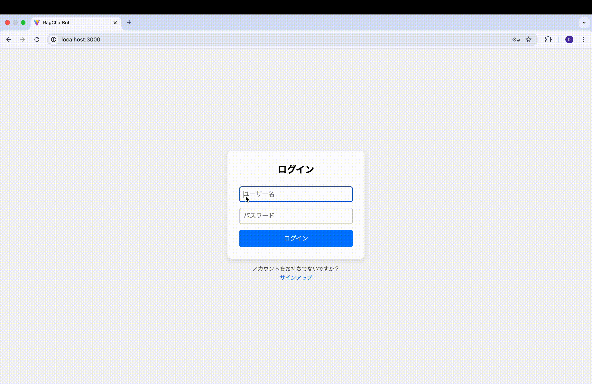

# ローカル用 AIチャットボット
## 概要
Django + React + PostgreSQL を使ったAIチャットボットアプリ。  
ローカル環境で動作し、RAG（Retrieval-Augmented Generation）を活用した応答を行う。  
技術学習のために作成。

## 技術スタック
- Backend: Django, PostgreSQL, LangChain, OpenAI API
- Frontend: React (Vite)
- Infrastructure: Docker, Docker Compose

## 主な機能
- ユーザー認証
- チャット履歴保存
- 外部データを活用したRAG応答

## セットアップ（ローカル環境）


1. **リポジトリをクローン**
    ```bash
    git clone git@github.com:dtct66/RagChatBot.git
    cd ragchatbot
    ```

2. **環境変数を設定**
    プロジェクトのルートに `.env` ファイルを作成し、以下のように設定します。
    ```ini
    
    POSTGRES_DB=your-database-name
    POSTGRES_USER=your-database-username
    POSTGRES_PASSWORD=your-database-password

    
    PGADMIN_DEFAULT_EMAIL=your-email
    PGADMIN_DEFAULT_PASSWORD=your-pgadmin-password


    
    OPENAI_API_KEY=your_api_key
    OPENAI_MODEL=model-name
    ```

3. **検索文章の作成と保存場所**
    ### **`rag/documents`ディレクトリの作成**
- `rag`ディレクトリ内に`documents`というディレクトリを作成します。
- このディレクトリ内にテキストファイルを追加します（例: `example.txt`）。
    ```text
    example.txt(ここでは架空の人物の紹介)
    佐藤健吾（32歳）はITエンジニアで論理的かつ冷静な性格だが、登山やキャンプが好きなアクティブ派。仕事ではリーダーシップを発揮し、休日はクラフトビール巡りを楽しむ。
    中村美咲（28歳）は広告代理店のマーケティング担当で、社交的かつ面倒見が良い。ヨガやカフェ巡り、写真撮影が趣味で、細かい気配りができるタイプ。
    高橋颯太（25歳）はフリーランスのWebデザイナーで、自由奔放で好奇心旺盛。ストリートファッションやスケートボードを楽しみつつ、独自のアイデアで仕事に取り組む。
    藤井莉奈（30歳）は小学校の先生で、温厚で優しい性格ながら芯が強い。読書や旅行、料理が趣味で、休日はカフェでミステリー小説を読むのが至福の時間。
    山本悠真（35歳）は人工知能の研究者で、理論派かつ知的好奇心が旺盛。普段は無口だが好きな話題には熱くなる。ボードゲームやジョギングが趣味で、お茶目な一面も持つ。
    ```
## 実行画面
<p align="center">
  
</p>

4. **Dockerコンテナを起動**
    Dockerコンテナをビルドして、起動します。
    ```bash
    docker-compose up --build　-d
    ```


5. **Djangoのマイグレーション**
    マイグレーションを実行して、データベースのセットアップを行います。
    ```bash
    docker-compose exec backend python manage.py migrate
    ```

6. **Superuserを作成 (管理画面用)**
    管理画面にアクセスするためのスーパーユーザーを作成します。
    ```bash
    docker-compose exec backend python manage.py createsuperuser
    ```

7. **フロントエンドのURLを検索**
    ```bash
    localhost:3000
    ```


## License

This project is licensed under the MIT License - see the [LICENSE](LICENSE) file for details.

